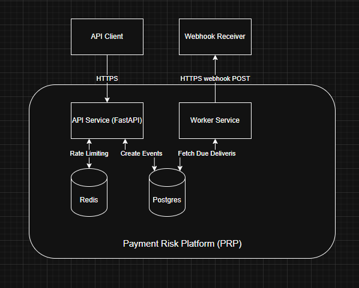

# Payment Risk Platform (PRP) — Architecture (v0)

## Purpose
This document describes the high-level architecture of PRP: major components, their responsibilities, and the primary data flows. It complements `spec.md` by focusing on **how** the system is structured (services, databases, and interactions), not the full behavioral contract.

## Architecture Summary
PRP is a multi-tenant payments simulator composed of:
- **API Service (FastAPI)**: synchronous request handling, tenant auth, durable state changes, and event creation.
- **Worker Service**: asynchronous processing (webhook delivery, retries, and other background jobs).
- **Postgres (Source of Truth)**: durable storage for tenants, payments, idempotency records, events, and delivery logs.
- **Redis (Ephemeral)**: per-tenant rate limiting and velocity counters.
- **Webhook Receiver (External)**: tenant-owned HTTP endpoint receiving signed webhook events.

## System Boundary

PRP operates as a containerized service boundary containing the API, worker, and supporting infrastructure (Postgres and Redis). External systems interact with PRP only via HTTPS.

External actors:
- **API Client**: calls PRP REST endpoints.
- **Webhook Receiver**: receives outbound webhook notifications from PRP.

All durable payment state changes occur within the PRP boundary and are persisted to Postgres before any external notification occurs.

## High-Level Architecture Diagram

The following diagram illustrates component boundaries and data flow.

## Component Responsibilities

### API Service (FastAPI)

Responsibilities:
- Authenticate API keys and resolve tenant context.
- Enforce tenant-scoped queries.
- Enforce idempotency for write endpoints.
- Validate and enforce PaymentIntent state transitions.
- Persist durable state changes to Postgres.
- Create Webhook Events and corresponding Webhook Deliveries.
- Perform rate limiting and velocity checks via Redis.

The API service is synchronous and handles client-facing request/response cycles.

---

### Worker Service

Responsibilities:
- Poll Postgres for due Webhook Deliveries.
- Perform HTTP webhook delivery attempts.
- Apply retry backoff logic.
- Update delivery attempt metadata (attempt_count, status, timestamps).
- Mark deliveries as dead_lettered after max attempts.

The worker is restart-safe and stateless; all durable retry state is stored in Postgres.

---

### Postgres (Source of Truth)

Responsibilities:
- Store all durable system state:
  - Tenants
  - API keys
  - Customers
  - PaymentIntents
  - Charges
  - Idempotency keys
  - Risk assessments
  - Webhook events
  - Webhook deliveries
- Provide transactional guarantees for state transitions.

Postgres is the authoritative system of record.

---

### Redis (Ephemeral Layer)

Responsibilities:
- Enforce per-tenant rate limiting.
- Maintain velocity counters (e.g., confirms per minute).
- Store short-lived operational counters.

Redis does not store durable payment state and may be rebuilt without data loss.

## Data Flows

This section describes the primary request and event-driven flows across PRP components.

### 4.1 PaymentIntent Creation (`POST /v1/payment_intents`)

1. **API Client → API Service**: sends HTTPS request to create a PaymentIntent.
2. **API Service**:
   - authenticates API key and resolves `tenant_id`
   - performs rate limit / velocity checks in Redis
   - enforces idempotency using `Idempotency-Key` (if present)
3. **API Service → Postgres**: creates a durable PaymentIntent record.
4. **API Service → API Client**: returns the created PaymentIntent.

Notes:
- This endpoint is designed to be safe for client retries via idempotency semantics.
- No webhooks are emitted on creation in v0 unless explicitly modeled.

---

### 4.2 PaymentIntent Confirmation (`POST /v1/payment_intents/{id}/confirm`)

1. **API Client → API Service**: sends HTTPS request to confirm a PaymentIntent.
2. **API Service**:
   - authenticates API key and resolves `tenant_id`
   - performs rate limit / velocity checks in Redis
   - loads the PaymentIntent from Postgres (tenant-scoped)
   - validates the PaymentIntent is in a confirmable state
   - enforces idempotency for retry safety
3. **API Service → Postgres** (transactional):
   - creates a Charge attempt (succeeded/failed)
   - updates PaymentIntent status (e.g., processing → succeeded/failed)
   - creates a Webhook Event representing the state change
   - creates Webhook Delivery rows for each enabled webhook endpoint
4. **API Service → API Client**: returns the updated PaymentIntent (and optionally a summary of the latest Charge).

Notes:
- Durable state is persisted before any outbound webhook attempt is made.
- Webhook delivery occurs asynchronously in the worker.

---

### 4.3 Webhook Delivery (Worker)

1. **Worker → Postgres**: queries for Webhook Deliveries that are due (`next_attempt_at <= now`) and not terminal.
2. **Worker → Webhook Receiver**: performs HTTPS POST with HMAC signature headers.
3. **Webhook Receiver → Worker**: returns HTTP response.
4. **Worker → Postgres**: updates the Webhook Delivery record:
   - on 2xx: mark delivered
   - on error/non-2xx/3xx: record last_error, increment attempt_count, schedule next_attempt_at
   - on max attempts exceeded: mark dead_lettered

Notes:
- Delivery is at-least-once; receivers must handle duplicates.
- Redirects (3xx) are treated as failures.

## Data Ownership & Boundaries

### Durable vs Ephemeral State
- **Postgres** owns all durable state (payments, events, deliveries, idempotency, fraud decisions).
- **Redis** owns only ephemeral operational counters (rate limiting, velocity) and is not required for historical reconstruction.

### Source of Truth
- Postgres is the authoritative record for:
  - PaymentIntent + Charge lifecycle
  - Webhook Events + Deliveries
  - Risk Assessments
- Webhook Receivers are external and non-authoritative; delivery success does not change durable payment outcomes.

### Stateless Services
- The API and worker are designed to be horizontally scalable and restart-safe:
  - durable state is persisted in Postgres
  - the worker resumes by scanning Postgres for due deliveries

  ## Key Design Decisions (v0)

- **Shared-table multi-tenancy**: tenant isolation is enforced via `tenant_id` on all durable tables and tenant-scoped queries.
- **At-least-once webhook delivery**: webhooks may be delivered more than once; receivers must deduplicate.
- **Persist-first eventing**: durable state transitions and event creation occur in Postgres before any outbound webhook attempts.
- **Retries are tracked durably**: webhook retry state is stored in Postgres (attempt counts, next attempt scheduling).